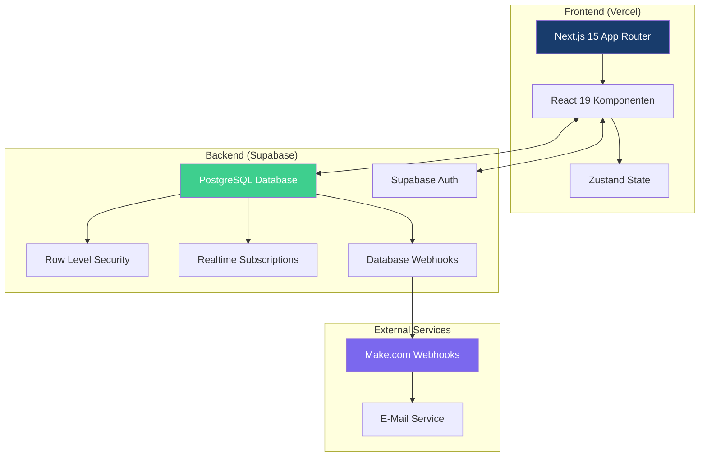
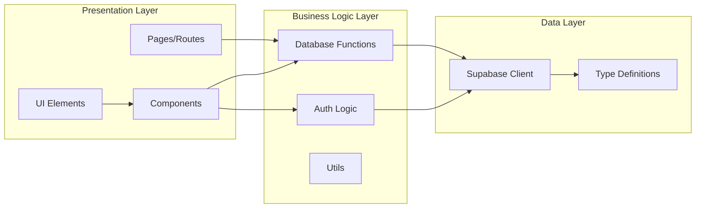
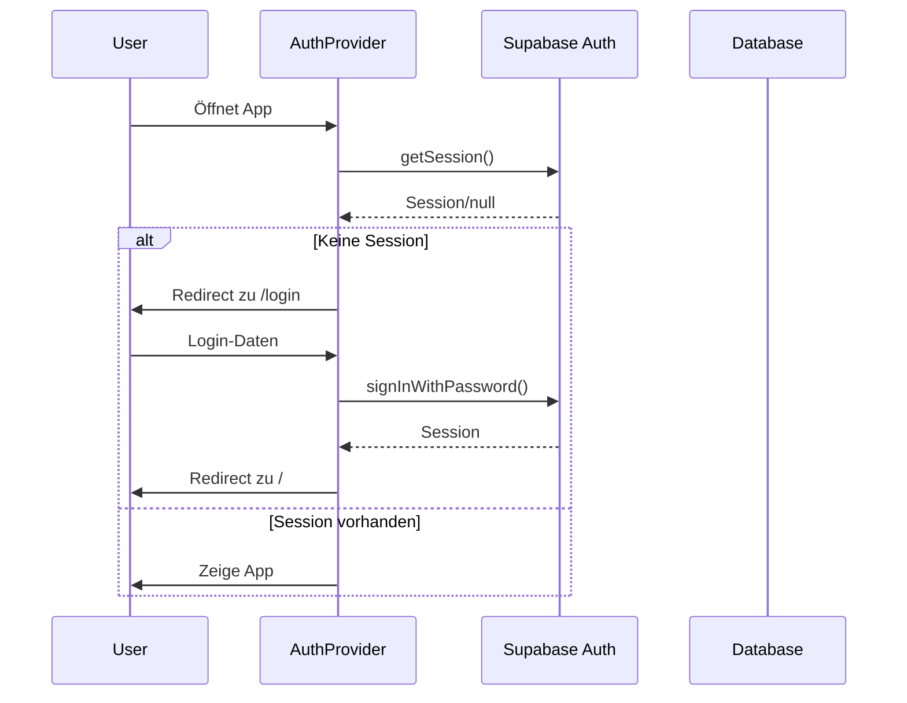
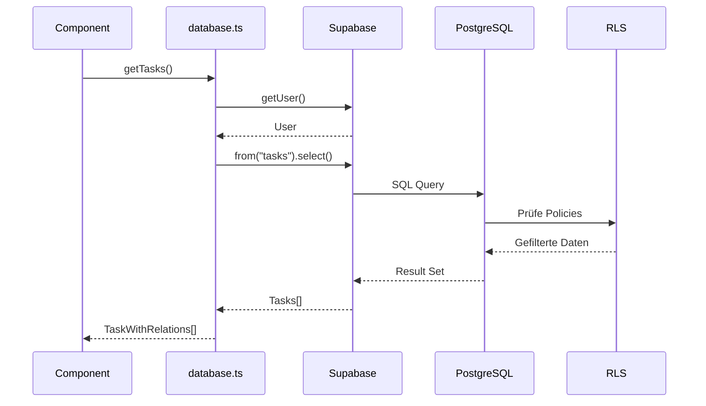
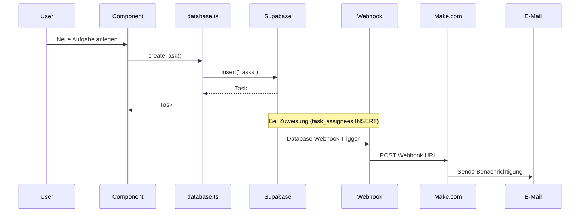
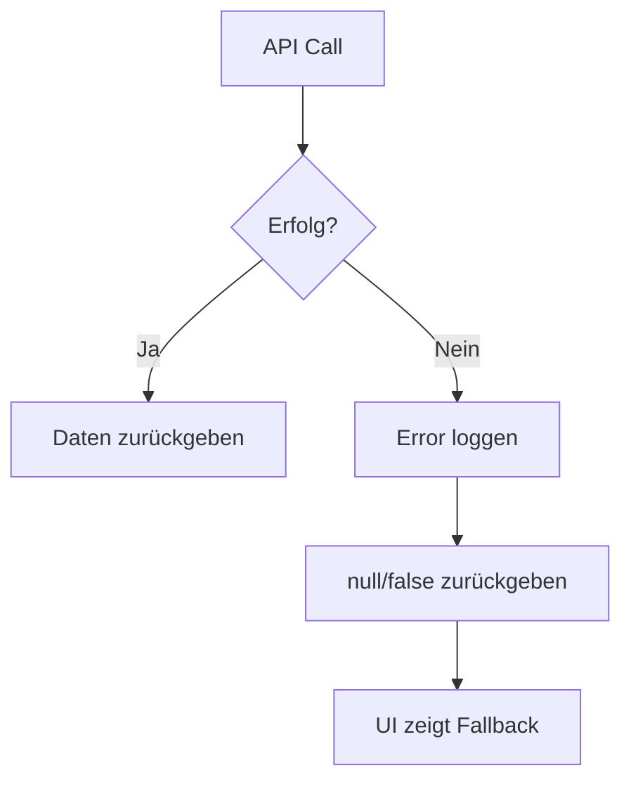

# Systemarchitektur

Dieses Dokument beschreibt die Architektur der STRATEGIE Projekte Anwendung.

## Architektur-Übersicht



## Schichtenarchitektur



## Ordnerstruktur mit Erklärungen

```
src/
├── app/                          # Next.js 15 App Router
│   ├── (auth)/                   # Auth-Gruppe (eigenes Layout)
│   │   ├── layout.tsx            # Minimales Layout für Auth
│   │   ├── login/page.tsx        # Login-Seite
│   │   └── register/page.tsx     # Registrierungs-Seite
│   ├── dashboard/page.tsx        # Dashboard mit Statistiken
│   ├── inbox/page.tsx            # Aufgaben ohne Projekt
│   ├── my-tasks/page.tsx         # Alle Aufgaben des Benutzers
│   ├── projects/[id]/page.tsx    # Dynamische Projektseite
│   ├── search/page.tsx           # Volltextsuche
│   ├── teams/page.tsx            # Team-Verwaltung
│   ├── today/page.tsx            # Heute fällige Aufgaben
│   ├── upcoming/page.tsx         # Kommende Aufgaben
│   ├── layout.tsx                # Root Layout mit Providers
│   ├── page.tsx                  # Startseite (Heute-Ansicht)
│   └── globals.css               # Globale Styles
│
├── components/                    # React-Komponenten
│   ├── charts/                   # Visualisierungen
│   │   └── DonutChart.tsx        # Kreisdiagramm für Dashboard
│   │
│   ├── filters/                  # Filter-Komponenten
│   │   └── TaskFilters.tsx       # Aufgaben-Filter
│   │
│   ├── layout/                   # Layout-Komponenten
│   │   ├── Header.tsx            # Seiten-Header
│   │   └── Sidebar.tsx           # Navigations-Sidebar
│   │
│   ├── projects/                 # Projekt-Komponenten
│   │   ├── ProjectSettingsModal.tsx  # Projekteinstellungen
│   │   └── ProjectTeamAccess.tsx     # Team-Zugriffsverwaltung
│   │
│   ├── providers/                # React Context Provider
│   │   ├── AuthProvider.tsx      # Authentifizierung
│   │   └── KeyboardShortcuts.tsx # Tastaturkürzel-Handler
│   │
│   ├── sections/                 # Sektionen-Komponenten
│   │   ├── DroppableSection.tsx  # Drag-&-Drop-Zielbereich
│   │   └── SectionList.tsx       # Sektionsliste
│   │
│   ├── tasks/                    # Aufgaben-Komponenten
│   │   ├── AssigneeSelector.tsx  # Benutzer zuweisen
│   │   ├── CommentList.tsx       # Kommentarliste
│   │   ├── LabelSelector.tsx     # Label-Auswahl
│   │   ├── QuickAddTask.tsx      # Schnelles Hinzufügen
│   │   ├── QuickAddTaskModal.tsx # Modal für neue Aufgabe
│   │   ├── RecurrenceSelector.tsx # Wiederholung konfigurieren
│   │   ├── SortableTaskItem.tsx  # Sortierbare Aufgabe
│   │   ├── SortableTaskList.tsx  # Sortierbare Liste
│   │   ├── SubtaskList.tsx       # Unteraufgaben
│   │   ├── TaskDetailModal.tsx   # Aufgabendetails (Modal)
│   │   ├── TaskDetailPanel.tsx   # Aufgabendetails (Side Panel)
│   │   └── TaskItem.tsx          # Einzelne Aufgabe
│   │
│   └── ui/                       # Basis-UI-Komponenten
│       ├── KeyboardShortcutsHelp.tsx # Shortcuts-Hilfe
│       └── Modal.tsx             # Modal-Container
│
├── lib/                          # Bibliotheken & Utilities
│   ├── database.ts               # Alle Supabase-Datenbankfunktionen
│   ├── supabase.ts               # Supabase-Client-Initialisierung
│   └── utils.ts                  # Hilfsfunktionen (cn, etc.)
│
└── types/                        # TypeScript-Typen
    └── database.ts               # Datenbank-Entitäten
```

## Datenfluss

### 1. Authentifizierung



### 2. Datenabfrage (Tasks)



### 3. Aufgabe erstellen mit Webhook



## Supabase-Integration

### Authentifizierung

Die App verwendet Supabase Auth mit:
- E-Mail/Passwort-Authentifizierung
- Session-Management über Cookies
- Automatische Token-Erneuerung

```typescript
// src/lib/supabase.ts
import { createClient } from '@supabase/supabase-js';

export const supabase = createClient(
  process.env.NEXT_PUBLIC_SUPABASE_URL!,
  process.env.NEXT_PUBLIC_SUPABASE_ANON_KEY!
);
```

### Row Level Security (RLS)

Alle Tabellen sind durch RLS-Policies geschützt:

- **tasks**: Nur eigene und Team-zugängliche Aufgaben
- **projects**: Nur eigene und Team-zugängliche Projekte
- **team_members**: Nur für Team-Mitglieder sichtbar
- **comments**: Nur bei Zugriff auf die zugehörige Aufgabe

### Realtime-Updates

Für bestimmte Tabellen sind Realtime-Subscriptions aktiviert:
- Aufgaben-Updates
- Kommentare
- Team-Änderungen

## State Management

### Zustand Store

Für globalen State wird Zustand verwendet:

```typescript
// Beispiel: Lokaler Komponenten-State
const [tasks, setTasks] = useState<TaskWithRelations[]>([]);

// Event-basierte Updates zwischen Komponenten
window.dispatchEvent(new Event("taskUpdated"));
window.addEventListener("taskUpdated", handleTaskUpdated);
```

### Custom Events

Komponenten kommunizieren über Custom Events:

| Event | Beschreibung |
|-------|--------------|
| `taskCreated` | Neue Aufgabe erstellt |
| `taskUpdated` | Aufgabe aktualisiert |
| `projectsUpdated` | Projekte geändert |
| `openNewTaskModal` | Quick-Add-Modal öffnen |
| `closeModals` | Alle Modals schließen |

## Fehlerbehandlung



Fehler werden in `database.ts` geloggt und die Funktionen geben `null` oder `false` zurück, damit die UI entsprechend reagieren kann.

## Performance-Optimierungen

1. **Server-Side Rendering**: Next.js App Router mit Server Components
2. **Turbopack**: Schnellere Builds in Development
3. **Lazy Loading**: Komponenten werden bei Bedarf geladen
4. **Batch-Queries**: Mehrere Daten in einer Anfrage laden
5. **Memoization**: React-Hooks für Performance-Optimierung
