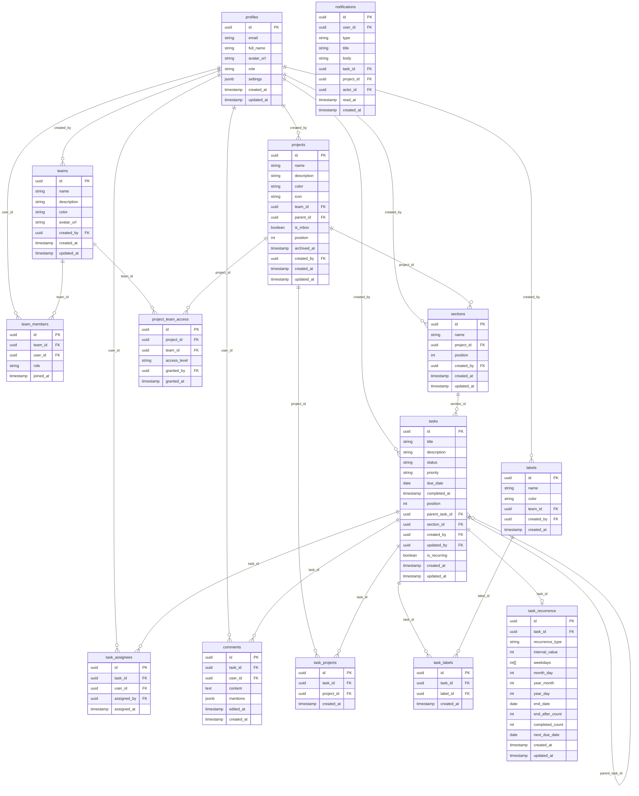

# Datenbankschema

Dieses Dokument beschreibt das vollständige Datenbankschema der STRATEGIE Projekte Anwendung, basierend auf Supabase (PostgreSQL).

## Entity-Relationship-Diagramm



## Tabellen-Dokumentation

### profiles

Speichert Benutzerprofile. Wird automatisch durch einen Trigger bei Supabase Auth-Registrierung erstellt.

| Spalte | Typ | Beschreibung |
|--------|-----|--------------|
| `id` | `uuid` | PK, entspricht `auth.users.id` |
| `email` | `text` | E-Mail-Adresse |
| `full_name` | `text` | Vollständiger Name |
| `avatar_url` | `text` | URL zum Profilbild |
| `role` | `text` | Systemrolle: `admin`, `manager`, `member` |
| `settings` | `jsonb` | Benutzereinstellungen |
| `created_at` | `timestamptz` | Erstellungszeitpunkt |
| `updated_at` | `timestamptz` | Letzte Änderung |

### teams

Gruppen von Benutzern für kollaboratives Arbeiten.

| Spalte | Typ | Beschreibung |
|--------|-----|--------------|
| `id` | `uuid` | PK |
| `name` | `text` | Team-Name |
| `description` | `text` | Beschreibung |
| `color` | `text` | Farbe (Hex) |
| `avatar_url` | `text` | Team-Avatar |
| `created_by` | `uuid` | FK zu profiles |
| `created_at` | `timestamptz` | Erstellungszeitpunkt |
| `updated_at` | `timestamptz` | Letzte Änderung |

### team_members

Zuordnung von Benutzern zu Teams mit Rollen.

| Spalte | Typ | Beschreibung |
|--------|-----|--------------|
| `id` | `uuid` | PK |
| `team_id` | `uuid` | FK zu teams |
| `user_id` | `uuid` | FK zu profiles |
| `role` | `text` | `owner`, `admin`, `member`, `viewer` |
| `joined_at` | `timestamptz` | Beitrittszeitpunkt |

**Team-Rollen:**

| Rolle | Beschreibung |
|-------|--------------|
| `owner` | Volle Kontrolle, kann Team löschen |
| `admin` | Kann Mitglieder und Einstellungen verwalten |
| `member` | Kann Aufgaben erstellen und bearbeiten |
| `viewer` | Nur Lesezugriff |

### projects

Aufgabenlisten/Projekte zur Organisation von Tasks.

| Spalte | Typ | Beschreibung |
|--------|-----|--------------|
| `id` | `uuid` | PK |
| `name` | `text` | Projektname |
| `description` | `text` | Beschreibung |
| `color` | `text` | Farbe (Hex), Default: `#183c6c` |
| `icon` | `text` | Icon-Name |
| `team_id` | `uuid` | FK zu teams (optional) |
| `parent_id` | `uuid` | FK zu projects (Unterprojekte) |
| `is_inbox` | `boolean` | Inbox-Marker |
| `position` | `int` | Sortierung |
| `archived_at` | `timestamptz` | Archivierungszeitpunkt |
| `created_by` | `uuid` | FK zu profiles |
| `created_at` | `timestamptz` | Erstellungszeitpunkt |
| `updated_at` | `timestamptz` | Letzte Änderung |

### project_team_access

Steuert den Zugriff von Teams auf Projekte.

| Spalte | Typ | Beschreibung |
|--------|-----|--------------|
| `id` | `uuid` | PK |
| `project_id` | `uuid` | FK zu projects |
| `team_id` | `uuid` | FK zu teams |
| `access_level` | `text` | `view`, `edit`, `admin` |
| `granted_by` | `uuid` | FK zu profiles |
| `granted_at` | `timestamptz` | Gewährungszeitpunkt |

**Zugriffsebenen:**

| Level | Beschreibung |
|-------|--------------|
| `view` | Lesen von Aufgaben |
| `edit` | Erstellen und Bearbeiten von Aufgaben |
| `admin` | Projekteinstellungen verwalten |

### sections

Abschnitte innerhalb eines Projekts zur weiteren Organisation.

| Spalte | Typ | Beschreibung |
|--------|-----|--------------|
| `id` | `uuid` | PK |
| `name` | `text` | Sektionsname |
| `project_id` | `uuid` | FK zu projects |
| `position` | `int` | Sortierung |
| `created_by` | `uuid` | FK zu profiles |
| `created_at` | `timestamptz` | Erstellungszeitpunkt |
| `updated_at` | `timestamptz` | Letzte Änderung |

### tasks

Haupttabelle für alle Aufgaben.

| Spalte | Typ | Beschreibung |
|--------|-----|--------------|
| `id` | `uuid` | PK |
| `title` | `text` | Aufgabentitel |
| `description` | `text` | Beschreibung |
| `status` | `text` | `todo`, `in_progress`, `done`, `archived` |
| `priority` | `text` | `p1`, `p2`, `p3`, `p4` |
| `due_date` | `date` | Fälligkeitsdatum |
| `completed_at` | `timestamptz` | Erledigungszeitpunkt |
| `position` | `int` | Sortierung |
| `parent_task_id` | `uuid` | FK zu tasks (Subtasks) |
| `section_id` | `uuid` | FK zu sections |
| `created_by` | `uuid` | FK zu profiles |
| `updated_by` | `uuid` | FK zu profiles |
| `is_recurring` | `boolean` | Wiederkehrende Aufgabe |
| `created_at` | `timestamptz` | Erstellungszeitpunkt |
| `updated_at` | `timestamptz` | Letzte Änderung |

**Status-Werte:**

| Status | Beschreibung |
|--------|--------------|
| `todo` | Offen |
| `in_progress` | In Bearbeitung |
| `done` | Erledigt |
| `archived` | Archiviert |

**Prioritäten:**

| Priorität | Farbe | Beschreibung |
|-----------|-------|--------------|
| `p1` | Rot | Kritisch |
| `p2` | Orange | Hoch |
| `p3` | Blau | Mittel |
| `p4` | Grau | Niedrig |

### task_projects

Verknüpft Aufgaben mit Projekten (Many-to-Many).

| Spalte | Typ | Beschreibung |
|--------|-----|--------------|
| `id` | `uuid` | PK |
| `task_id` | `uuid` | FK zu tasks |
| `project_id` | `uuid` | FK zu projects |
| `created_at` | `timestamptz` | Erstellungszeitpunkt |

### task_assignees

Zuweisung von Aufgaben zu Benutzern.

| Spalte | Typ | Beschreibung |
|--------|-----|--------------|
| `id` | `uuid` | PK |
| `task_id` | `uuid` | FK zu tasks |
| `user_id` | `uuid` | FK zu profiles |
| `assigned_by` | `uuid` | FK zu profiles |
| `assigned_at` | `timestamptz` | Zuweisungszeitpunkt |

### labels

Benutzerdefinierte Tags für Aufgaben.

| Spalte | Typ | Beschreibung |
|--------|-----|--------------|
| `id` | `uuid` | PK |
| `name` | `text` | Label-Name |
| `color` | `text` | Farbe (Hex) |
| `team_id` | `uuid` | FK zu teams (optional) |
| `created_by` | `uuid` | FK zu profiles |
| `created_at` | `timestamptz` | Erstellungszeitpunkt |

### task_labels

Verknüpft Aufgaben mit Labels (Many-to-Many).

| Spalte | Typ | Beschreibung |
|--------|-----|--------------|
| `id` | `uuid` | PK |
| `task_id` | `uuid` | FK zu tasks |
| `label_id` | `uuid` | FK zu labels |
| `created_at` | `timestamptz` | Erstellungszeitpunkt |

### comments

Kommentare an Aufgaben.

| Spalte | Typ | Beschreibung |
|--------|-----|--------------|
| `id` | `uuid` | PK |
| `task_id` | `uuid` | FK zu tasks |
| `user_id` | `uuid` | FK zu profiles |
| `content` | `text` | Kommentartext |
| `mentions` | `jsonb` | Array von User-IDs |
| `edited_at` | `timestamptz` | Letzte Bearbeitung |
| `created_at` | `timestamptz` | Erstellungszeitpunkt |

### task_recurrence

Konfiguration für wiederkehrende Aufgaben.

| Spalte | Typ | Beschreibung |
|--------|-----|--------------|
| `id` | `uuid` | PK |
| `task_id` | `uuid` | FK zu tasks |
| `recurrence_type` | `text` | `daily`, `weekly`, `monthly`, `yearly`, `custom` |
| `interval_value` | `int` | Intervall (z.B. alle 2 Tage) |
| `weekdays` | `int[]` | Wochentage (0-6, Sonntag=0) |
| `month_day` | `int` | Tag des Monats (1-31, -1=letzter) |
| `year_month` | `int` | Monat des Jahres (1-12) |
| `year_day` | `int` | Tag des Jahres |
| `end_date` | `date` | Enddatum |
| `end_after_count` | `int` | Nach X Wiederholungen beenden |
| `completed_count` | `int` | Anzahl abgeschlossener Wiederholungen |
| `next_due_date` | `date` | Nächstes Fälligkeitsdatum |
| `created_at` | `timestamptz` | Erstellungszeitpunkt |
| `updated_at` | `timestamptz` | Letzte Änderung |

### notifications

Benutzerbenachrichtigungen.

| Spalte | Typ | Beschreibung |
|--------|-----|--------------|
| `id` | `uuid` | PK |
| `user_id` | `uuid` | FK zu profiles |
| `type` | `text` | Benachrichtigungstyp |
| `title` | `text` | Titel |
| `body` | `text` | Nachrichtentext |
| `task_id` | `uuid` | FK zu tasks (optional) |
| `project_id` | `uuid` | FK zu projects (optional) |
| `actor_id` | `uuid` | FK zu profiles (Auslöser) |
| `read_at` | `timestamptz` | Lesezeitpunkt |
| `created_at` | `timestamptz` | Erstellungszeitpunkt |

## Row Level Security (RLS) Policies

Alle Tabellen sind durch RLS geschützt. Hier eine Übersicht der wichtigsten Policies:

### tasks

```sql
-- Benutzer kann eigene Aufgaben lesen
CREATE POLICY "Users can read own tasks" ON tasks
  FOR SELECT USING (created_by = auth.uid());

-- Benutzer kann Team-Aufgaben lesen (über project_team_access)
CREATE POLICY "Users can read team tasks" ON tasks
  FOR SELECT USING (
    EXISTS (
      SELECT 1 FROM task_projects tp
      JOIN project_team_access pta ON tp.project_id = pta.project_id
      JOIN team_members tm ON pta.team_id = tm.team_id
      WHERE tp.task_id = tasks.id
        AND tm.user_id = auth.uid()
    )
  );

-- Benutzer kann eigene Aufgaben erstellen
CREATE POLICY "Users can create own tasks" ON tasks
  FOR INSERT WITH CHECK (created_by = auth.uid());

-- Benutzer kann eigene oder zugewiesene Aufgaben bearbeiten
CREATE POLICY "Users can update accessible tasks" ON tasks
  FOR UPDATE USING (
    created_by = auth.uid() OR
    EXISTS (
      SELECT 1 FROM task_assignees
      WHERE task_id = tasks.id AND user_id = auth.uid()
    )
  );
```

### projects

```sql
-- Benutzer kann eigene Projekte lesen
CREATE POLICY "Users can read own projects" ON projects
  FOR SELECT USING (created_by = auth.uid());

-- Benutzer kann Team-Projekte lesen
CREATE POLICY "Users can read team projects" ON projects
  FOR SELECT USING (
    EXISTS (
      SELECT 1 FROM project_team_access pta
      JOIN team_members tm ON pta.team_id = tm.team_id
      WHERE pta.project_id = projects.id
        AND tm.user_id = auth.uid()
    )
  );
```

### team_members

```sql
-- Mitglieder können andere Mitglieder ihres Teams sehen
CREATE POLICY "Team members can see each other" ON team_members
  FOR SELECT USING (
    EXISTS (
      SELECT 1 FROM team_members tm2
      WHERE tm2.team_id = team_members.team_id
        AND tm2.user_id = auth.uid()
    )
  );
```

### comments

```sql
-- Kommentare sind sichtbar, wenn die zugehörige Aufgabe sichtbar ist
CREATE POLICY "Users can read comments on accessible tasks" ON comments
  FOR SELECT USING (
    EXISTS (
      SELECT 1 FROM tasks
      WHERE tasks.id = comments.task_id
        AND (
          tasks.created_by = auth.uid() OR
          EXISTS (
            SELECT 1 FROM task_assignees
            WHERE task_id = tasks.id AND user_id = auth.uid()
          )
        )
    )
  );
```

## Indizes

Empfohlene Indizes für Performance:

```sql
-- Tasks
CREATE INDEX idx_tasks_created_by ON tasks(created_by);
CREATE INDEX idx_tasks_status ON tasks(status);
CREATE INDEX idx_tasks_due_date ON tasks(due_date);
CREATE INDEX idx_tasks_section_id ON tasks(section_id);
CREATE INDEX idx_tasks_parent_task_id ON tasks(parent_task_id);

-- Task Projects
CREATE INDEX idx_task_projects_task_id ON task_projects(task_id);
CREATE INDEX idx_task_projects_project_id ON task_projects(project_id);

-- Task Assignees
CREATE INDEX idx_task_assignees_task_id ON task_assignees(task_id);
CREATE INDEX idx_task_assignees_user_id ON task_assignees(user_id);

-- Team Members
CREATE INDEX idx_team_members_team_id ON team_members(team_id);
CREATE INDEX idx_team_members_user_id ON team_members(user_id);

-- Project Team Access
CREATE INDEX idx_project_team_access_project_id ON project_team_access(project_id);
CREATE INDEX idx_project_team_access_team_id ON project_team_access(team_id);
```

## Trigger

### Automatische Profilerstellung

```sql
CREATE OR REPLACE FUNCTION public.handle_new_user()
RETURNS trigger AS $$
BEGIN
  INSERT INTO public.profiles (id, email, full_name)
  VALUES (new.id, new.email, new.raw_user_meta_data->>'full_name');
  RETURN new;
END;
$$ LANGUAGE plpgsql SECURITY DEFINER;

CREATE TRIGGER on_auth_user_created
  AFTER INSERT ON auth.users
  FOR EACH ROW EXECUTE FUNCTION public.handle_new_user();
```

### Automatische Timestamp-Updates

```sql
CREATE OR REPLACE FUNCTION update_updated_at()
RETURNS trigger AS $$
BEGIN
  NEW.updated_at = NOW();
  RETURN NEW;
END;
$$ LANGUAGE plpgsql;

-- Anwenden auf alle relevanten Tabellen
CREATE TRIGGER update_tasks_updated_at
  BEFORE UPDATE ON tasks
  FOR EACH ROW EXECUTE FUNCTION update_updated_at();
```
