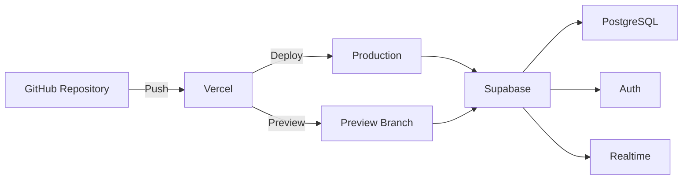

# Deployment

Dieses Dokument beschreibt das Deployment der STRATEGIE Projekte Anwendung auf Vercel und die Konfiguration von Supabase.

## Übersicht



## Vercel Deployment

### Voraussetzungen

1. GitHub Repository mit dem Projektcode
2. Vercel-Account (kann mit GitHub verknüpft werden)
3. Supabase-Projekt

### Ersteinrichtung

1. **Vercel-Projekt erstellen:**
   - Gehe zu [vercel.com](https://vercel.com)
   - Klicke auf "New Project"
   - Importiere das GitHub Repository

2. **Framework-Einstellungen:**
   - Framework Preset: `Next.js`
   - Build Command: `npm run build` (automatisch erkannt)
   - Output Directory: `.next` (automatisch erkannt)
   - Install Command: `npm install`

3. **Root Directory:**
   - Leer lassen (Projekt ist im Root)

### Umgebungsvariablen

Folgende Variablen müssen in Vercel konfiguriert werden:

| Variable | Beschreibung | Beispiel |
|----------|--------------|----------|
| `NEXT_PUBLIC_SUPABASE_URL` | Supabase-Projekt-URL | `https://xxx.supabase.co` |
| `NEXT_PUBLIC_SUPABASE_ANON_KEY` | Öffentlicher API-Key | `eyJhbGciOiJIUzI1...` |

**Konfiguration:**

1. Gehe zu Project Settings → Environment Variables
2. Füge jede Variable hinzu
3. Wähle die Environments: Production, Preview, Development
4. Klicke "Save"

### Build-Konfiguration

Die `next.config.ts` ist minimal konfiguriert:

```typescript
import type { NextConfig } from "next";

const nextConfig: NextConfig = {
  // Turbopack für schnellere Builds
};

export default nextConfig;
```

Build-Kommandos in `package.json`:

```json
{
  "scripts": {
    "dev": "next dev --turbopack",
    "build": "next build --turbopack",
    "start": "next start",
    "lint": "eslint"
  }
}
```

### Automatisches Deployment

Vercel deployt automatisch bei:

- **Push zu `main`**: Production Deployment
- **Push zu anderen Branches**: Preview Deployment
- **Pull Requests**: Preview mit Kommentar

### Custom Domain

1. Gehe zu Project Settings → Domains
2. Füge Domain hinzu: `strategie-projekte.vercel.app` (automatisch)
3. Für eigene Domain: DNS-Einstellungen konfigurieren

## Supabase Konfiguration

### Projekt erstellen

1. Gehe zu [supabase.com](https://supabase.com)
2. Klicke "New Project"
3. Wähle Organisation und Region
4. Setze Projekt-Name und Datenbank-Passwort

### Datenbank-Setup

1. **SQL Editor öffnen** (links in der Navigation)

2. **Tabellen erstellen:**
   - Siehe [DATABASE.md](./DATABASE.md) für das vollständige Schema
   - Alle CREATE TABLE Statements ausführen

3. **RLS aktivieren:**
   ```sql
   ALTER TABLE tasks ENABLE ROW LEVEL SECURITY;
   ALTER TABLE projects ENABLE ROW LEVEL SECURITY;
   -- etc. für alle Tabellen
   ```

4. **Policies erstellen:**
   - Siehe RLS-Abschnitt in DATABASE.md

5. **Trigger erstellen:**
   ```sql
   -- Profil bei Registrierung erstellen
   CREATE OR REPLACE FUNCTION public.handle_new_user()
   RETURNS trigger AS $$
   BEGIN
     INSERT INTO public.profiles (id, email, full_name)
     VALUES (new.id, new.email, new.raw_user_meta_data->>'full_name');
     RETURN new;
   END;
   $$ LANGUAGE plpgsql SECURITY DEFINER;

   CREATE TRIGGER on_auth_user_created
     AFTER INSERT ON auth.users
     FOR EACH ROW EXECUTE FUNCTION public.handle_new_user();
   ```

### Authentication

1. **Auth Settings** (Authentication → Providers):
   - E-Mail/Passwort aktiviert
   - Optional: OAuth Provider (Google, GitHub, etc.)

2. **E-Mail-Templates** (Authentication → Email Templates):
   - Bestätigungsmail anpassen
   - Password Reset anpassen

3. **URL Configuration** (Authentication → URL Configuration):
   - Site URL: `https://strategie-projekte.vercel.app`
   - Redirect URLs: `https://strategie-projekte.vercel.app/**`

### API-Schlüssel

In Project Settings → API findest du:

- **Project URL**: `NEXT_PUBLIC_SUPABASE_URL`
- **anon public**: `NEXT_PUBLIC_SUPABASE_ANON_KEY`

Diese Werte in Vercel Environment Variables eintragen.

### Database Webhooks

Für E-Mail-Benachrichtigungen via Make.com:

1. Gehe zu Database → Webhooks
2. Erstelle Webhooks für:
   - `task_assignees` INSERT
   - `comments` INSERT
   - `tasks` UPDATE (mit Bedingung für status)

Siehe [INTEGRATIONS.md](./INTEGRATIONS.md) für Details.

## Lokale Entwicklung

### Setup

1. **Repository klonen:**
   ```bash
   git clone <repository-url>
   cd strategie-projekte
   ```

2. **Dependencies installieren:**
   ```bash
   npm install
   ```

3. **Environment-Variablen:**

   Erstelle `.env.local`:
   ```env
   NEXT_PUBLIC_SUPABASE_URL=https://your-project.supabase.co
   NEXT_PUBLIC_SUPABASE_ANON_KEY=your-anon-key
   ```

4. **Entwicklungsserver starten:**
   ```bash
   npm run dev
   ```

5. **Öffnen:**
   [http://localhost:3000](http://localhost:3000)

### Lokale Supabase-Instanz (Optional)

Für offline-Entwicklung kann Supabase lokal laufen:

```bash
# Supabase CLI installieren
npm install -g supabase

# Projekt initialisieren
supabase init

# Lokale Instanz starten
supabase start

# Lokale Credentials anzeigen
supabase status
```

## Monitoring & Logging

### Vercel Analytics

1. Project Settings → Analytics aktivieren
2. Web Vitals überwachen
3. Traffic-Statistiken einsehen

### Vercel Logs

1. Deployments → Deployment auswählen
2. "Functions" Tab für Serverless-Logs
3. "Build Logs" für Build-Output

### Supabase Logs

1. Database → Logs für Query-Logs
2. Authentication → Logs für Auth-Events
3. API → Logs für API-Requests

## Troubleshooting

### Build-Fehler

**Problem:** TypeScript-Fehler

```bash
# Lokal prüfen
npm run build
```

**Lösung:** Typfehler in den angezeigten Dateien beheben.

---

**Problem:** Missing Environment Variables

```
Error: NEXT_PUBLIC_SUPABASE_URL is not defined
```

**Lösung:** Variablen in Vercel konfigurieren und Re-deploy.

---

### Runtime-Fehler

**Problem:** 401 Unauthorized bei Supabase

**Ursache:** Falscher oder abgelaufener API-Key

**Lösung:**
1. Prüfe `NEXT_PUBLIC_SUPABASE_ANON_KEY`
2. Regeneriere Key bei Bedarf in Supabase

---

**Problem:** RLS-Fehler (keine Daten sichtbar)

**Ursache:** Fehlende oder falsche RLS-Policies

**Lösung:**
1. SQL Editor in Supabase öffnen
2. Policies prüfen: `SELECT * FROM pg_policies;`
3. Policies anpassen

---

### Performance

**Problem:** Langsame Ladezeiten

**Lösungen:**
1. Indizes in Supabase prüfen
2. Query-Anzahl reduzieren (Batching)
3. Caching implementieren
4. Edge Functions verwenden

## Backup & Recovery

### Datenbank-Backup

Supabase erstellt automatische Backups:

1. Database → Backups
2. Point-in-time Recovery (PITR) verfügbar
3. Manueller Download möglich

### Manueller Export

```bash
# Mit pg_dump
pg_dump -h db.xxx.supabase.co -p 5432 -U postgres -d postgres > backup.sql
```

### Import

```bash
psql -h db.xxx.supabase.co -p 5432 -U postgres -d postgres < backup.sql
```

## Security Checklist

- [ ] RLS für alle Tabellen aktiviert
- [ ] Policies korrekt konfiguriert
- [ ] NEXT_PUBLIC_* nur für öffentliche Daten
- [ ] Service Role Key NICHT im Frontend
- [ ] HTTPS für alle Verbindungen
- [ ] Content Security Policy konfiguriert
- [ ] Rate Limiting aktiv
