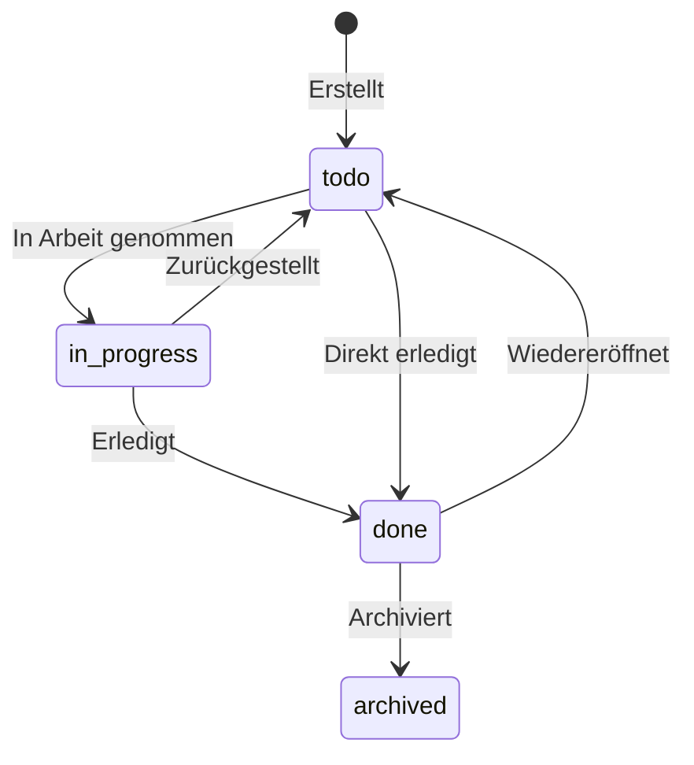
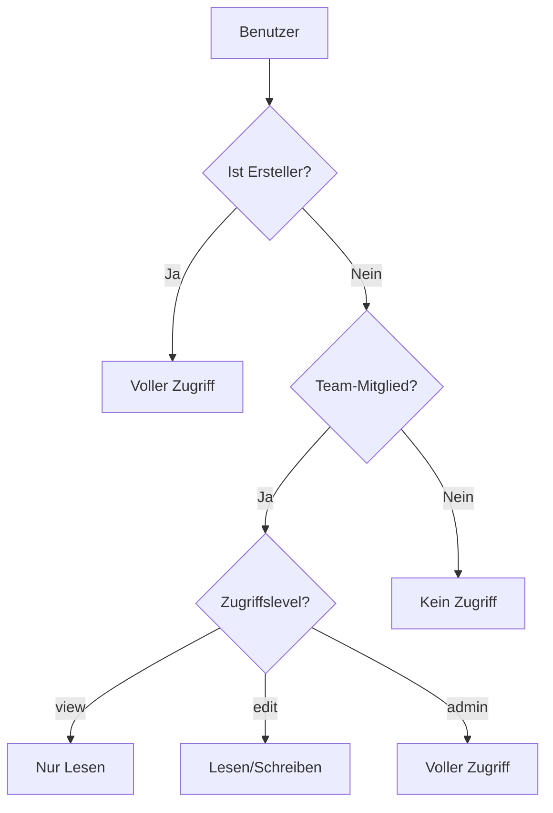

# Features

Dieses Dokument beschreibt alle implementierten Features der STRATEGIE Projekte Anwendung.

## Aufgabenverwaltung

### CRUD-Operationen

Vollständige Verwaltung von Aufgaben:

- **Erstellen**: Über Quick-Add-Button, Modal oder Tastaturkürzel `N`
- **Lesen**: In verschiedenen Ansichten (Heute, Inbox, Projekt, Suche)
- **Aktualisieren**: Inline-Bearbeitung und Detail-Panel
- **Löschen**: Mit Bestätigungsdialog

### Prioritäten

Vier Prioritätsstufen zur Kategorisierung:

| Priorität | Farbe | Bedeutung |
|-----------|-------|-----------|
| P1 | Rot (`#dc2626`) | Kritisch - Sofortige Bearbeitung |
| P2 | Orange (`#f59e0b`) | Hoch - Zeitnah erledigen |
| P3 | Blau (`#3b82f6`) | Mittel - Normale Priorität |
| P4 | Grau (`#e0e0e0`) | Niedrig - Bei Gelegenheit |

### Status

Aufgaben durchlaufen folgende Stati:

| Status | Beschreibung |
|--------|--------------|
| `todo` | Offen - Noch nicht begonnen |
| `in_progress` | In Arbeit - Wird aktuell bearbeitet |
| `done` | Erledigt - Abgeschlossen |
| `archived` | Archiviert - Aus aktiver Ansicht entfernt |

### Fälligkeitsdaten

- Datumsauswahl über nativen Date-Picker
- Farbliche Markierung überfälliger Aufgaben
- Anzeige in "Heute" und "Anstehend" Ansichten
- Automatische Sortierung nach Fälligkeit

## Projekte (Aufgabenlisten)

### Projektorganisation

- Eigene Farbe pro Projekt (für visuelle Unterscheidung)
- Fortschrittsanzeige in der Sidebar
- Projekt-spezifische Sektionen
- Archivierungsfunktion

### Sektionen

Unterteilen von Projekten in logische Abschnitte:

- Erstellen neuer Sektionen
- Umbenennen und Löschen
- Drag-&-Drop-Sortierung
- Aufgaben zwischen Sektionen verschieben

### Projekteinstellungen

Über das Einstellungs-Modal:

- Name und Beschreibung bearbeiten
- Projektfarbe ändern
- Team-Zugriff verwalten
- Projekt löschen

## Team-System

### Rollen

Hierarchische Rollenstruktur:

| Rolle | Rechte |
|-------|--------|
| **Owner** | Volle Kontrolle, Team löschen, alle anderen Rechte |
| **Admin** | Mitglieder verwalten, Rollen ändern, Projekte zuweisen |
| **Member** | Aufgaben erstellen/bearbeiten, Kommentieren |
| **Viewer** | Nur Lesezugriff auf zugewiesene Projekte |

### Team-Verwaltung

- Teams erstellen und bearbeiten
- Mitglieder einladen
- Rollen zuweisen und ändern
- Team-Farbe und Avatar

### Projekt-Zugriff

Teams erhalten Zugriff auf Projekte mit verschiedenen Ebenen:

| Zugriff | Beschreibung |
|---------|--------------|
| `view` | Aufgaben anzeigen |
| `edit` | Aufgaben erstellen und bearbeiten |
| `admin` | Projekteinstellungen verwalten |

## RLS-basierte Zugriffskontrolle

### Sicherheitskonzept

Row Level Security (RLS) in Supabase garantiert:

- Benutzer sehen nur eigene Aufgaben
- Team-Mitglieder sehen Team-Projekte
- Keine API-Umgehung möglich
- Automatische Filterung auf Datenbankebene

### Zugriffshierarchie

## Wiederkehrende Aufgaben

### Wiederholungsmuster

| Typ | Beschreibung |
|-----|--------------|
| **Täglich** | Jeden Tag oder alle X Tage |
| **Wöchentlich** | An bestimmten Wochentagen, alle X Wochen |
| **Monatlich** | Am X. Tag des Monats, alle X Monate |
| **Jährlich** | Einmal pro Jahr am gleichen Tag |
| **Benutzerdefiniert** | Flexible Konfiguration |

### Konfigurationsoptionen

- **Intervall**: Alle X Tage/Wochen/Monate/Jahre
- **Wochentage**: Mo-So für wöchentliche Wiederholung
- **Monatstag**: 1-31 oder "Letzter Tag des Monats"
- **Endbedingung**: Nie, an Datum X, nach X Wiederholungen

### Automatische Neuerstellung

Beim Erledigen einer wiederkehrenden Aufgabe:

1. Aktuelle Aufgabe wird als erledigt markiert
2. Nächstes Fälligkeitsdatum wird berechnet
3. Neue Aufgabe mit Recurrence wird erstellt
4. Alle Eigenschaften werden kopiert (Labels, Assignees, Projekt)

## Subtasks

### Hierarchie

- Aufgaben können Unteraufgaben haben
- Beliebige Verschachtelungstiefe
- Fortschrittsanzeige (X von Y erledigt)

### Subtask-Verwaltung

- Schnelles Hinzufügen im Detail-Panel
- Checkbox zum Erledigen
- Löschen einzelner Subtasks
- Gleiche Status-Logik wie Hauptaufgaben

## Labels

### Eigenschaften

- Frei definierbare Namen
- Individuelle Farben
- Pro Benutzer (persönlich)
- Mehrere Labels pro Aufgabe möglich

### Verwaltung

- Im Task-Detail-Panel hinzufügen/entfernen
- Labels erstellen und löschen
- Farbauswahl über Picker

## Kommentare

### Funktionen

- Textnachrichten an Aufgaben
- Anzeige mit Autor und Zeitstempel
- Chronologische Sortierung
- Löschen eigener Kommentare

### Darstellung

- Avatar oder Initialen des Autors
- Relative Zeitangaben (vor 5 Minuten, gestern, etc.)
- Formatierter Text

## Aufgabenzuweisung

### Multi-Assignee

- Mehrere Benutzer pro Aufgabe möglich
- Avatar-Anzeige bei Aufgaben
- Dropdown-Auswahl im Detail-Panel

### Zuweisungsbenachrichtigung

Bei Zuweisung wird über Make.com Webhook eine E-Mail-Benachrichtigung ausgelöst.

## Suche

### Volltextsuche

- Durchsucht Titel und Beschreibung
- Sofortige Ergebnisse (Debounced)
- Projektfilter in Ergebnissen
- Prioritätsanzeige

### Suchansicht

Dedizierte Seite unter `/search`:

- Eingabefeld mit Icon
- Ergebnisliste mit Task-Items
- Klick öffnet Task-Detail

## Dashboard

### Statistiken

Übersicht aller Aufgaben:

- **Gesamt**: Alle Aufgaben
- **In Arbeit**: Status `in_progress`
- **Überfällig**: Fällig vor heute, nicht erledigt
- **Erledigt**: Status `done`, inkl. "heute erledigt"

### Diagramme

- **Status-Donut**: Verteilung nach Status
- **Prioritäts-Donut**: Offene Aufgaben nach Priorität

### Wochenübersicht

- 7-Tage-Kalender (Mo-So)
- Markierung des aktuellen Tages
- Anzeige erledigter Aufgaben pro Tag
- Anzeige fälliger Aufgaben pro Tag

### Projektübersicht

Pro Projekt:

- Fortschrittsbalken
- Aufgabenanzahl (erledigt/gesamt)
- Überfällige Aufgaben
- Direkt-Link zum Projekt

### Team-Übersicht

Pro Team-Mitglied:

- Avatar und Name
- Offene Aufgaben
- In Arbeit befindliche Aufgaben
- Überfällige Aufgaben

## E-Mail-Benachrichtigungen

Über Make.com Webhooks (siehe [INTEGRATIONS.md](./INTEGRATIONS.md)):

1. **Aufgabe zugewiesen** - Bei INSERT in `task_assignees`
2. **Neuer Kommentar** - Bei INSERT in `comments`
3. **Aufgabe erledigt** - Bei UPDATE auf `status=done`
4. **Tägliche Fälligkeits-Mail** - Via Scheduler

## Keyboard Shortcuts

### Schnellnavigation (Ziffern)

| Taste | Aktion |
|-------|--------|
| `1` | Dashboard öffnen |
| `2` | Heute/Startseite öffnen |
| `3` | Meine Aufgaben öffnen |
| `4` | Anstehend öffnen |
| `5` | Eingang öffnen |
| `6` | Suche öffnen |

### Navigation (g + Taste)

| Tasten | Aktion |
|--------|--------|
| `g d` | Dashboard öffnen |
| `g h` | Heute/Startseite öffnen |
| `g t` | Heute/Startseite öffnen (alias) |
| `g m` | Meine Aufgaben öffnen |
| `g u` | Anstehend öffnen |
| `g i` | Eingang öffnen |
| `g s` | Suche öffnen |

### Aktionen

| Taste | Aktion |
|-------|--------|
| `N` | Neue Aufgabe erstellen (Quick-Add) |
| `/` | Zur Suche navigieren |
| `?` | Shortcuts-Hilfe anzeigen |
| `Escape` | Modal/Panel schließen |

### Hilfe-Modal

Über `?` erreichbare Übersicht aller Shortcuts mit Beschreibungen.

## Drag & Drop

### Implementierung mit dnd-kit

- Aufgaben innerhalb einer Liste sortieren
- Aufgaben zwischen Sektionen verschieben
- Visuelle Feedback während des Ziehens
- Automatische Positionsaktualisierung

## Ansichten

### Heute (`/` und `/today`)

Zeigt alle Aufgaben mit Fälligkeitsdatum heute.

### Inbox (`/inbox`)

Zeigt eigene Aufgaben ohne Projektzuordnung.

### Meine Aufgaben (`/my-tasks`)

Alle eigenen Aufgaben, unabhängig vom Projekt.

### Anstehend (`/upcoming`)

Aufgaben mit Fälligkeitsdatum in der Zukunft, gruppiert nach Datum.

### Projekte (`/projects/[id]`)

Projekt-spezifische Aufgabenansicht mit Sektionen.

### Teams (`/teams`)

Team-Verwaltung und Übersicht.

### Dashboard (`/dashboard`)

Statistiken und Gesamtübersicht.

### Suche (`/search`)

Volltextsuche über alle zugänglichen Aufgaben.

## Responsive Design

Die Anwendung ist für Desktop optimiert mit:

- Fester Sidebar (resizable, 200-400px)
- Anpassungsfähige Content-Bereiche
- Modale für Detail-Ansichten
- Touch-freundliche Interaktionen (geplant)
