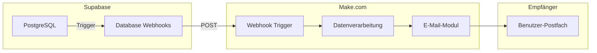
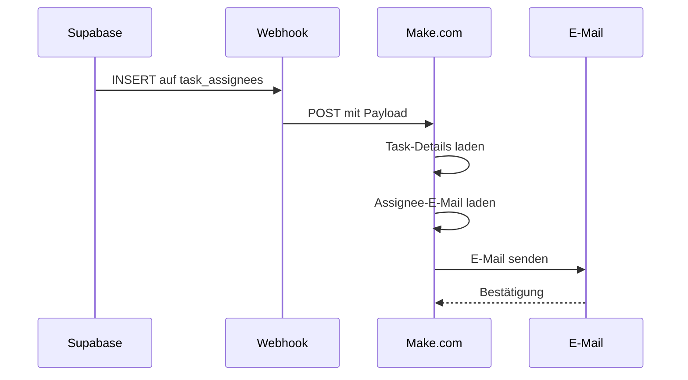

# Integrationen

Dieses Dokument beschreibt die Integration mit externen Services, insbesondere Make.com für E-Mail-Benachrichtigungen.

## Übersicht



## Make.com Webhook-Integration

### Was ist Make.com?

Make.com (ehemals Integromat) ist eine No-Code Automatisierungsplattform, die verschiedene Services miteinander verbindet. Wir nutzen Make.com, um bei bestimmten Datenbank-Events automatisch E-Mails zu versenden.

### Warum Make.com?

- Keine Server-Infrastruktur nötig
- Visueller Workflow-Editor
- Einfache E-Mail-Integration
- Kostenloser Einstieg
- Zuverlässige Ausführung

## Die 4 Workflows

### 1. Aufgabe zugewiesen

**Trigger:** `task_assignees` INSERT

**Zweck:** Benachrichtigt einen Benutzer, wenn ihm eine Aufgabe zugewiesen wird.



**Webhook-Payload (von Supabase):**
```json
{
  "type": "INSERT",
  "table": "task_assignees",
  "record": {
    "id": "uuid",
    "task_id": "uuid",
    "user_id": "uuid",
    "assigned_by": "uuid",
    "assigned_at": "timestamp"
  },
  "schema": "public"
}
```

**Make.com Workflow:**

1. **Webhook Module** (Trigger)
   - Empfängt POST von Supabase
   - Parst JSON-Payload

2. **HTTP Module** (Task-Details)
   - GET an Supabase REST API
   - URL: `{SUPABASE_URL}/rest/v1/tasks?id=eq.{task_id}`
   - Header: `apikey: {ANON_KEY}`

3. **HTTP Module** (User-E-Mail)
   - GET an Supabase REST API
   - URL: `{SUPABASE_URL}/rest/v1/profiles?id=eq.{user_id}`

4. **E-Mail Module**
   - An: `{user.email}`
   - Betreff: `Neue Aufgabe zugewiesen: {task.title}`
   - Inhalt: HTML-Template mit Task-Details

**E-Mail-Template:**
```html
<h2>Neue Aufgabe zugewiesen</h2>
<p>Dir wurde eine neue Aufgabe zugewiesen:</p>
<div style="background: #f5f5f5; padding: 16px; border-radius: 8px;">
  <h3 style="color: #183c6c;">{task.title}</h3>
  <p>{task.description}</p>
  <p>
    <strong>Priorität:</strong> {task.priority}<br>
    <strong>Fällig:</strong> {task.due_date}
  </p>
</div>
<p>
  <a href="https://strategie-projekte.vercel.app" style="background: #183c6c; color: white; padding: 12px 24px; border-radius: 8px; text-decoration: none;">
    Aufgabe öffnen
  </a>
</p>
```

---

### 2. Neuer Kommentar

**Trigger:** `comments` INSERT

**Zweck:** Benachrichtigt den Aufgaben-Ersteller und alle Assignees über neue Kommentare.

**Webhook-Payload:**
```json
{
  "type": "INSERT",
  "table": "comments",
  "record": {
    "id": "uuid",
    "task_id": "uuid",
    "user_id": "uuid",
    "content": "text",
    "created_at": "timestamp"
  }
}
```

**Make.com Workflow:**

1. **Webhook Module** (Trigger)

2. **HTTP Module** (Task + Ersteller laden)
   ```
   GET /tasks?id=eq.{task_id}&select=*,profiles:created_by(*)
   ```

3. **HTTP Module** (Assignees laden)
   ```
   GET /task_assignees?task_id=eq.{task_id}&select=user_id,profiles(email)
   ```

4. **HTTP Module** (Kommentator-Name)
   ```
   GET /profiles?id=eq.{comment.user_id}
   ```

5. **Iterator Module**
   - Über alle Empfänger iterieren
   - Kommentator selbst ausschließen

6. **E-Mail Module**
   - An jeden Empfänger senden

**E-Mail-Template:**
```html
<h2>Neuer Kommentar</h2>
<p><strong>{commenter.full_name}</strong> hat einen Kommentar hinterlassen:</p>
<blockquote style="border-left: 4px solid #183c6c; padding-left: 16px; margin: 16px 0;">
  {comment.content}
</blockquote>
<p>
  Zur Aufgabe: <strong>{task.title}</strong>
</p>
```

---

### 3. Aufgabe erledigt

**Trigger:** `tasks` UPDATE mit Bedingung `status = 'done'`

**Zweck:** Benachrichtigt den Aufgaben-Ersteller, wenn ein Assignee die Aufgabe erledigt.

**Supabase Webhook Konfiguration:**

```sql
-- Webhook nur bei Status-Änderung zu 'done'
-- Filter: record.status = 'done' AND old_record.status != 'done'
```

**Webhook-Payload:**
```json
{
  "type": "UPDATE",
  "table": "tasks",
  "record": {
    "id": "uuid",
    "title": "string",
    "status": "done",
    "completed_at": "timestamp",
    "created_by": "uuid",
    "updated_by": "uuid"
  },
  "old_record": {
    "status": "in_progress"
  }
}
```

**Make.com Workflow:**

1. **Webhook Module** (Trigger)

2. **Filter Module**
   - Nur wenn `record.status = 'done'`
   - Nur wenn `record.updated_by != record.created_by`

3. **HTTP Module** (Ersteller laden)
   ```
   GET /profiles?id=eq.{created_by}
   ```

4. **HTTP Module** (Erlediger laden)
   ```
   GET /profiles?id=eq.{updated_by}
   ```

5. **E-Mail Module**

**E-Mail-Template:**
```html
<h2>Aufgabe erledigt ✓</h2>
<p><strong>{completer.full_name}</strong> hat die Aufgabe erledigt:</p>
<div style="background: #d1fae5; padding: 16px; border-radius: 8px;">
  <h3 style="color: #059669;">{task.title}</h3>
  <p>Erledigt am: {task.completed_at}</p>
</div>
```

---

### 4. Tägliche Fälligkeits-Mail

**Trigger:** Make.com Scheduler (täglich um 7:00 Uhr)

**Zweck:** Sendet jedem Benutzer eine Übersicht seiner heute fälligen Aufgaben.

**Make.com Workflow:**

1. **Scheduler Module** (Trigger)
   - Zeitplan: Täglich 07:00 UTC

2. **HTTP Module** (Alle aktiven Benutzer)
   ```
   GET /profiles?select=id,email,full_name
   ```

3. **Iterator Module**
   - Über alle Benutzer

4. **HTTP Module** (Fällige Aufgaben pro Benutzer)
   ```
   GET /tasks?or=(created_by.eq.{user.id},task_assignees.user_id.eq.{user.id})&due_date=eq.{today}&status=neq.done
   ```

5. **Filter Module**
   - Nur wenn Aufgaben vorhanden

6. **E-Mail Module**

**E-Mail-Template:**
```html
<h2>Deine Aufgaben für heute</h2>
<p>Guten Morgen {user.full_name},</p>
<p>Du hast {count} Aufgaben für heute:</p>
<ul>
  {{#each tasks}}
  <li>
    <strong style="color: {{priority_color}};">{{title}}</strong>
    {{#if project}} - {{project.name}}{{/if}}
  </li>
  {{/each}}
</ul>
<p>
  <a href="https://strategie-projekte.vercel.app/today">
    Alle Aufgaben anzeigen
  </a>
</p>
```

---

## Supabase Database Webhooks Konfiguration

### Webhook erstellen

1. Öffne Supabase Dashboard
2. Gehe zu Database → Webhooks
3. Klicke "Create a new webhook"

### Konfiguration für task_assignees INSERT

| Feld | Wert |
|------|------|
| Name | `notify_task_assigned` |
| Table | `task_assignees` |
| Events | `INSERT` |
| Type | `HTTP Request` |
| Method | `POST` |
| URL | `https://hook.eu1.make.com/xxx...` |
| Headers | `Content-Type: application/json` |

### Konfiguration für comments INSERT

| Feld | Wert |
|------|------|
| Name | `notify_new_comment` |
| Table | `comments` |
| Events | `INSERT` |
| Type | `HTTP Request` |
| Method | `POST` |
| URL | `https://hook.eu1.make.com/yyy...` |

### Konfiguration für tasks UPDATE

| Feld | Wert |
|------|------|
| Name | `notify_task_completed` |
| Table | `tasks` |
| Events | `UPDATE` |
| Type | `HTTP Request` |
| Method | `POST` |
| URL | `https://hook.eu1.make.com/zzz...` |

**Filter-Funktion (optional):**
```sql
-- In der Webhook-Konfiguration
-- Nur triggern wenn Status sich zu 'done' ändert
NEW.status = 'done' AND OLD.status != 'done'
```

## Make.com Scenario Setup

### Neues Scenario erstellen

1. Gehe zu make.com → Scenarios
2. Klicke "Create a new scenario"
3. Füge "Webhooks" Modul hinzu → "Custom webhook"
4. Kopiere die generierte Webhook-URL

### Module hinzufügen

```
[Webhook] → [HTTP Request] → [Filter] → [Email]
```

### HTTP Request Modul für Supabase

**Einstellungen:**
- URL: `https://{project-id}.supabase.co/rest/v1/{table}`
- Method: `GET`
- Headers:
  - `apikey`: `{ANON_KEY}`
  - `Authorization`: `Bearer {ANON_KEY}`

### E-Mail Modul

**Provider-Optionen:**
- Gmail
- SMTP
- SendGrid
- Mailgun

**Empfohlene Einstellung:**
- Eigener SMTP-Server oder
- SendGrid für höhere Limits

## Fehlerbehandlung

### Webhook-Fehler in Supabase

1. Database → Webhooks → Logs
2. Prüfe HTTP-Statuscode
3. Bei 4xx: URL oder Payload prüfen
4. Bei 5xx: Make.com Scenario prüfen

### Fehler in Make.com

1. Scenario öffnen
2. "History" Tab
3. Fehlgeschlagene Ausführungen prüfen
4. "Error handling" Module hinzufügen

### Error Handler hinzufügen

```
[Module] → [Error Handler: Resume] → [Slack/Email Notification]
```

## Rate Limits

### Supabase Webhooks
- Keine harten Limits
- Bei hohem Volume: Batching empfohlen

### Make.com
- Free Plan: 1.000 Operations/Monat
- Basic Plan: 10.000 Operations/Monat
- Bei Überschreitung: Upgrade nötig

## Sicherheit

### Webhook-URL schützen

1. **Geheimes Token verwenden:**
   - In Supabase Header hinzufügen: `X-Webhook-Secret: {secret}`
   - In Make.com prüfen

2. **IP-Whitelist (optional):**
   - Supabase IPs erlauben

### Sensible Daten

- Keine Passwörter in Webhooks
- E-Mail-Adressen nur für legitime Zwecke
- DSGVO beachten: Opt-out für E-Mails

## Monitoring

### Make.com Dashboard

- Ausführungshistorie
- Fehlerrate
- Durchschnittliche Dauer

### Alerts einrichten

1. Scenario Settings → Notifications
2. Bei Fehler: E-Mail/Slack Benachrichtigung
